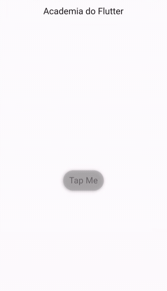

<h1 align="center">

  
Tap Me Button

</h1>

Este projeto foi criado para fins didáticos, com a finalidade de participar do desafio proposto pelo Rodrigo Rahman da Academia do Flutter no dia 20/06/2023.
  
Proposta de criar um botão com bordas arredondadas como mostrado abaixo:

    

## Parâmetros

| Parâmetro         | Funcionalidade                                                       | Tipo      | Obrigatório |
| ----------------- | -------------------------------------------------------------------- | --------  | ----------- |
| text              | Texto a ser exibido no botão                                         | String?   |  Sim        |
| onTap             | Função a ser executada ao clicar                                     | Function? |  Sim        |
| duration          | Duração da animação ao tocar o botão                                 | Duration  |  Não        |
| backgroundColor   | Cor de fundo do botão                                                | Color?    |  Não        |
| textColor         | Cor do texto do botão                                                | Color?    |  Não        |
| pulsePx           | Valor em pixels que o botão se expande na animação ao tocar no botão | int       |  Não        |
| height            | Altura do botão                                                      | Double    |  Não        |
| width             | Largura do botão                                                     | Double    |  Não        |
| enabled           | Habilita ou desabilita o botão                                       | bool      |  Não        |
